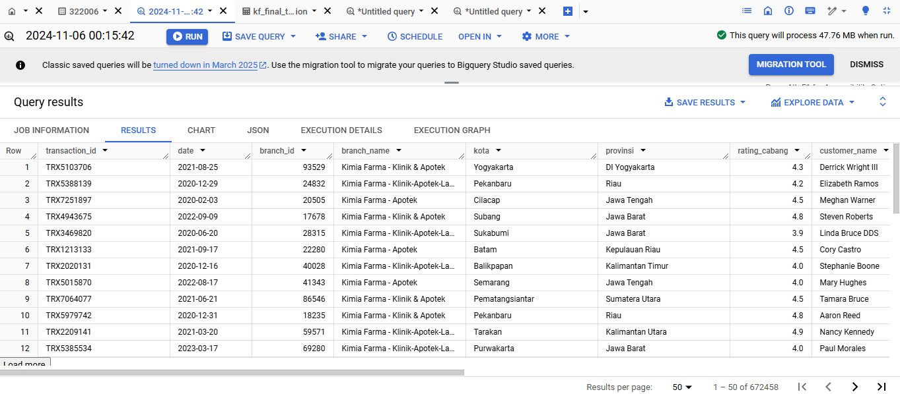

# Overview 
Project ini merupakan final task dari program Project Based Internship by Rakamin Academy. Perusahaan yang menjadi taget dalam project ini adalah PT. Kimia Farma TBK yang merupakan industry yang bergerak dibidang farmasi. Goal yang ingin dicapai dalam project ini yaitu melakukan Analisa terhadap kinerja bisnis pada perusahaan Kimia Farma dari tahun 2020-2023. Terdapat 4 dataset yang menjadi bahan analisis dalam project ini diantaranya kf_analysis, kf_final_transaction, kf_inventory,kf_product, dan kf_kantor cabang. Selai itu, project ini juga mengikutkan dashboard yang dibuat dengan Looker Studio.

# Hasil Tabel Analisis
